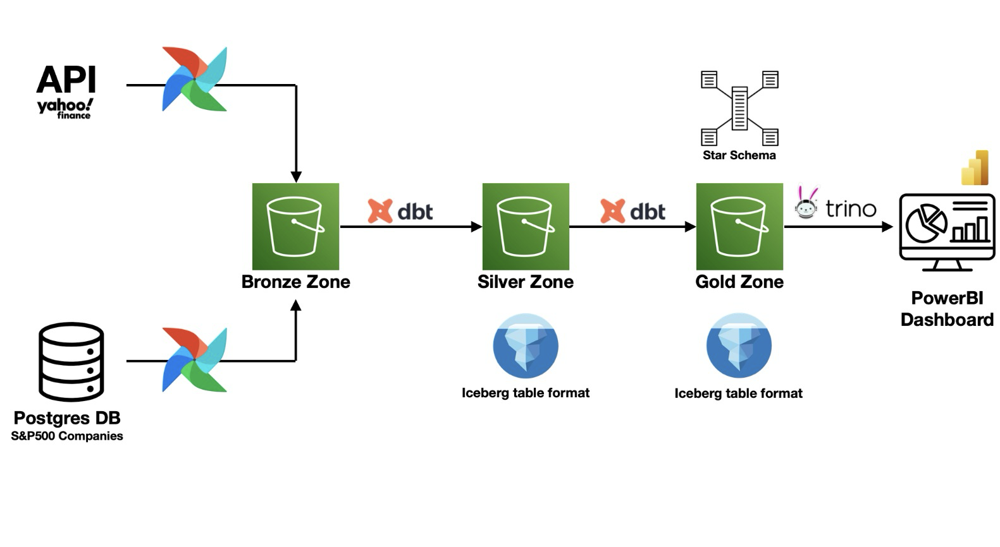
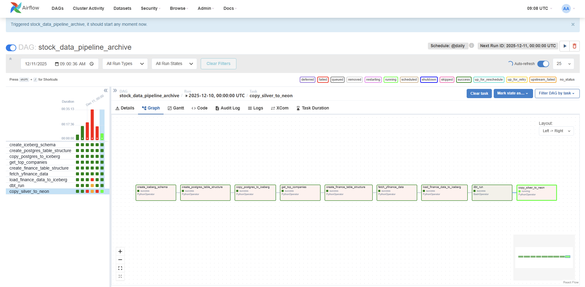
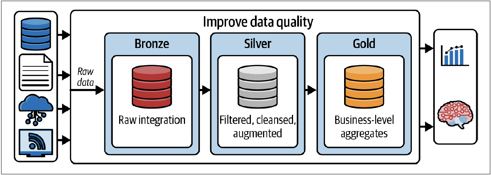
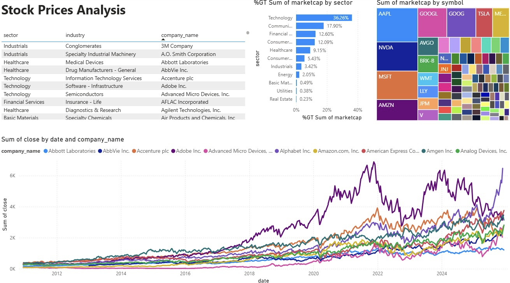

# S&P 500 Data Pipeline

An end-to-end **Lakehouse-based ELT data pipeline** for ingesting, transforming, and analyzing S&P 500 market data. This project demonstrates modern data engineering best practices by combining near real-time financial data with structured metadata and delivering analytics-ready datasets for BI consumption.

---

## 📌 Project Overview

The goal of this project is to build a **scalable, modular, and analytics-optimized data pipeline** that:

- Ingests near real-time stock price data from **Yahoo Finance**
- Enriches it with static company metadata from **PostgreSQL**
- Applies the **Medallion Architecture (Bronze, Silver, Gold)**
- Stores data in an **Apache Iceberg Lakehouse** on S3-compatible storage
- Serves fast analytical queries via **Trino**
- Powers interactive dashboards in **Power BI**

The final outcome is a business-ready analytics layer enabling sector and company performance analysis for the **Top 100 S&P 500 companies**.

---

## 🏗️ System Architecture

  

The pipeline follows a **modern Lakehouse architecture**, decoupling storage and compute while maintaining strong data consistency and performance.

---

## 🧰 Technology Stack

| Layer | Tools |
|-----|------|
| Orchestration | Apache Airflow |
| Storage | MinIO (S3-compatible) |
| Table Format | Apache Iceberg |
| Query Engine | Trino |
| Transformations | dbt |
| Metadata Source | PostgreSQL |
| Market Data | Yahoo Finance API |
| Visualization | Power BI |

---

## 🔄 Data Flow

1. **Ingestion**
   - Company master data extracted from PostgreSQL
   - Market price data pulled from Yahoo Finance API at near real-time intervals

2. **Bronze Layer (Raw)**
   - Raw JSON and CSV files stored immutably in MinIO
   - Append-only with ingestion timestamps

3. **Silver Layer (Cleansed)**
   - Deduplication and schema enforcement
   - Data quality checks and null handling via dbt

4. **Gold Layer (Curated)**
   - Business-level aggregates modeled for analytics
   - Optimized for BI and reporting workloads

5. **Consumption**
   - Trino queries Iceberg tables
   - Power BI connects to Trino for visualization

---

## ⏱️ Orchestration with Airflow

  

Apache Airflow acts as the **central orchestration layer**, providing:

- Clear DAG-based task dependencies
- Automated scheduling aligned with market close
- Retry logic and failure handling
- Full observability via logs and execution metrics

---

## 🥉🥈🥇 Medallion Architecture

  

### Bronze (Raw)
- Raw market and metadata files
- Immutable, append-only storage
- No transformations applied

### Silver (Cleansed)
- Cleaned and validated datasets
- Deduplicated records
- Enforced schemas and quality checks

### Gold (Curated)
- Analytics-ready datasets
- Business-focused modeling
- Optimized for fast aggregations

---

## ⭐ Gold Layer Data Model

The Gold layer is implemented using a **Star Schema** optimized for BI workloads.

### Fact Table
- `fact_daily_stock_prices`
  - Open, High, Low, Close
  - Volume
  - Date Key
  - Company Key

### Dimension Tables
- `dim_company` (Company Name, Sector, Headquarters)
- `dim_time` (Date, Day, Month, Quarter, Year)

This design significantly improves query performance and dashboard responsiveness.

---

## 🧪 Data Quality & Engineering Practices

- Modular SQL transformations using dbt
- Built-in tests:
  - Not-null constraints
  - Uniqueness checks
- Version-controlled transformations with Git
- Automatic lineage and dependency graphs

---

## 📈 Power BI Dashboard

  

The final Power BI dashboard enables:

- Trend analysis using moving averages
- Sector-based performance comparison
- Interactive filtering by date and sector
- High-performance visuals powered by Star Schema modeling

---

## 🚀 Scalability & Performance

- Designed to handle growing historical data without degradation
- Iceberg enables partitioning, schema evolution, and time travel
- Trino provides distributed SQL execution
- Storage and compute are fully decoupled

---

## ✅ Key Outcomes

- Fully automated pipeline replacing manual data collection
- Production-grade Lakehouse architecture
- Clean separation of concerns via Medallion Architecture
- Scalable foundation for additional data sources

---

## 🔮 Future Enhancements

- Real-time streaming ingestion using Kafka
- Data freshness and SLA monitoring
- Additional financial indicators and metrics
- Infrastructure provisioning using Terraform
- Migration to cloud-native S3

---

## 👤 Author

**Khaled Aljarbou**  
Data Team Leader

---

## 📄 License

This project is intended for educational and portfolio purposes.